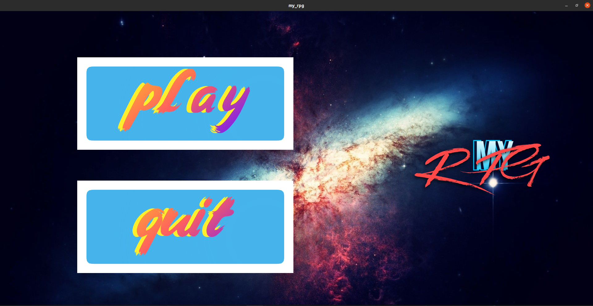
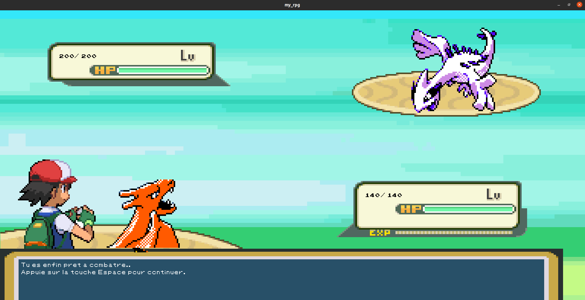

# My_RPG 

Le projet My_RPG est le plus important du module qui correspond à la création de jeu video à EPITECH, en première annéee.

Ce projet est l'un des projets les plus libres de notre première année. 
Le but est de créer notre propre RPG.
Le principal défi pour ce jeu sera de créer un jeu complet en utilisant tout ce que nous avons appris durant la création des jeux précdent et d'aller plus loin.
Notre RPG doit suivre les règles suivantes :

Le joueur doit avoir des caractéristiques que nous pouvons trouver dans le menu.
Le joueur peut combattre des ennemis, les statistiques auront un impact sur les résultats des combats.
Il doit y avoir des intéraction avec des PNJ dans votre jeu (dialogues).
Nous devons implémenter au moins une quête principal (ici vaincre le Boss).
Le joueur doit avoir un inventaire qui peut contenir un ensemble limité d'objets.
Le joueur peut gagner de l'expérience en remportant des combats et en accomplissant des actions spécifiques.
Avec suffisamment d'expérience, le joueur peut monter de niveau, améliorant ses statistiques.
Pour donner aux utilisateurs le sentiment que vous offrez un produit complet, vous devez peaufiner autant que possible votre jeu.

Avoir une interface utilisateur agréable.
Créer un univers cohérent (assets visuels, assets audio, scénario, . . .)
Créez un jeu amusant où le joueur a au moins un but.
Créer un jeu avec un début et une fin

## But du programme

Créer un jeu de style RPG avec un persoonage, des combats, un système d'XP, un Boss, des dialogues et un menu.

## Fonctions autorisées

```

	• Toutes les fonctions de la CSFML
	• Toutes les fonctions de la librairie Math
	• malloc, free, memset, (s)rand, getline, (f)open, (f)read, (f)close, (f)write, opendir, readdir, closedir
	
```

## Mise en route

Ces instructions vous permettront d'obtenir une copie du projet opérationnel sur votre machine locale à des fins de développement et de test.

### Pré-requis

De quoi avez-vous besoin pour installer le logiciel et comment l'installer ?

```

gcc
make

```

### Installation

Compilation du projet

```
make
```

Lancement du projet

```
./my_rpg
```

## Captures d'écrans

Le menu principal:


Lancement du jeu :


Combat de farm avec choix du Pokemon:


Combat boss:



