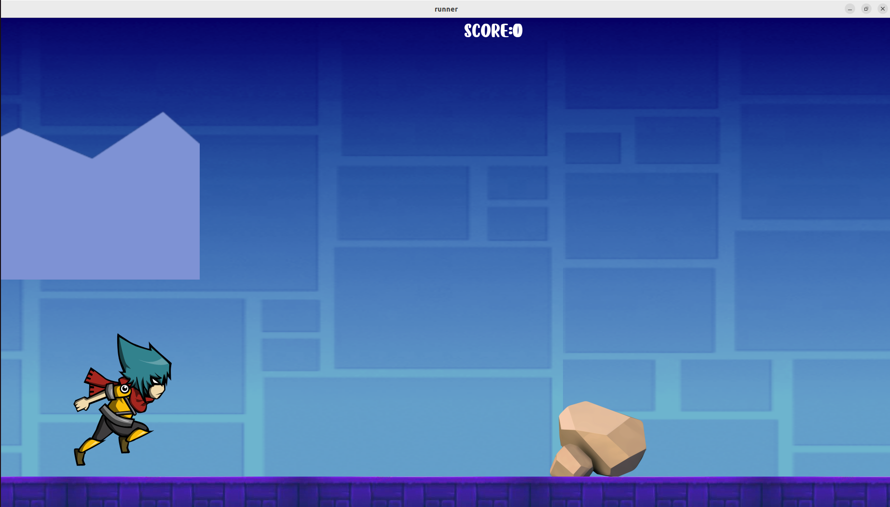

# My_Runner

Le projet My_runner est le premier projet du module qui correspond à la création de jeu video à EPITECH, en première annéee.

Ce projet est l'un des projets les plus libres de notre première année. 
Le but est de créer notre propre Runner.
Le principal défi pour ce jeu sera de créer notre premier jeu de l'année en utilisant la librairie CSFML.
Notre Runner doit suivre les règles suivantes :

le joueur est un personnage qui court dans une carte que vous avez prise en paramètre. 
Les ennemis et les obstacles doivent apparaître du côté opposé à la position du joueur.
Le joueur peut utiliser la barre d'espace pour sauter et éviter les obstacles et les ennemis. 
Au fur et à mesure que le joueur court, un score, qui sera affiché, augmentera. 
Lorsque le joueur meurt ou termine la carte, le score s'affiche dans la fenêtre. 


## But du programme

Créer un jeu de style Runner avec un personnage qui se déplace de manière continu le but est de :
		• lire un fichier décrivant un environnement et l'utiliser pour rendre un visuel. 
		• gérer la physique de base du jeu. 
		• gérer plusieurs entités en même temps.

## Fonctions autorisées

```

	• Toutes les fonctions de la CSFML
	• Toutes les fonctions de la librairie Math
	• malloc, free, memset, (s)rand, getline, (f)open, (f)read, (f)close, (f)write, opendir, readdir, closedir
	
```

## Mise en route

Ces instructions vous permettront d'obtenir une copie du projet opérationnel sur votre machine locale à des fins de développement et de test.

### Pré-requis

De quoi avez-vous besoin pour installer le logiciel et comment l'installer ?

```

gcc
make

```

### Installation

Compilation du projet

```
make
```

Lancement du projet

```
./my_runner map.txt
```

## Captures d'écrans

Lancement du jeu :


Gameplay :



